## Software Architecture Document

## 1. Introduction

[The introduction of the Software Architecture Document should provide an overview of the entire Software Architecture Document. It should include the purpose, scope, definitions, acronyms, abbreviations, references, and overview of the Software Architecture Document.]

### 1.1 Purpose

This document provides a comprehensive architectural overview of the system, using a number of different architectural views to depict different aspects of the system. It is intended to capture and convey the significant architectural decisions which have been made on the system.
[This section defines the purpose of the Software Architecture Document, in the overall project documentation, and briefly describes the structure of the document. The specific audiences for the document should be identified, with an indication of how they are expected to use the document.]

### 1.2 Scope

[A brief description of what the Software Architecture Document applies to; what is affected or influenced by this document.]

### 1.3 Definitions, Acronyms and Abbreviations

[This subsection should provide the definitions of all terms, acronyms, and abbreviations required to properly interpret the Software Architecture Document. This information may be provided by reference to the project Glossary.]

### 1.4 References

[This subsection should provide a complete list of all documents referenced elsewhere in the Software Architecture Document. Each document should be identified by title, report number (if applicable), date, and publishing organization. Specify the sources from which the references can be obtained. This information may be provided by reference to an appendix or to another document.]

### 1.5 Overview

[This subsection should describe what the rest of the Software Architecture Document contains and explain how the Software Architecture Document is organized.]

## 2. Architectural Representation

This document presents the architectural as a series of views; use case view, process view, deployment view, and implementation view. These views are presented as Rational Rose Models and use the Unified Modeling Language (UML).

## 3. Architectural Goals and Constraints
有一些關鍵的要求和系統結構和安全性有重要的影響。分別為:
1.本系統的功能需要透過google帳號登入才能進行。
2.本系統提供查詢某些數據的功能，所以系統的接口必須能夠負擔一定的流量。
3.所有關於客戶帳號的隱私必須保證他們的安全性。
4.在開發體系結構時，必須考慮到系統的負載量及性能要求。

## 4. Use-Case View

[This section lists use cases or scenarios from the use-case model if they represent some significant, central functionality of the final system, or if they have a large architectural coverage - they exercise many architectural elements, or if they stress or illustrate a specific, delicate point of the architecture.]

### 4.1 Use-Case Realizations

[This section illustrates how the software actually works by giving a few selected use-case (or scenario) realizations, and explains how the various design model elements contribute to their functionality.]

## 5. Logical View
### 5.1 Overview

本節是對於我們系統logic view，描述了系統所用到的類別，還會分成好幾種包，並描述了各個包之間的關係與組織，還包含了重要的Use case的實踐過程，而且可以讓你了解本系統的子系統、package和layer之間的關係。

### 5.2 Architecturally Significant Design Packages

我們的系統主要包含5個主要軟件包
分別為:
1.Presentation
    本包為介紹使用者與系統通訊的主要架構，包含了各種的boundary，並提供使用者顯示頁面、變更設定、搜尋資料、預約等等的功能。
2.Application
    本包主要為系統內部本身運算的函式及架構，包含各種的controller，提供系統獲取資料、建立新資料、傳送data至google日曆、更新、disable或enable預約等功能。
3.Domain
    包含了一些room package、reservation package、account package、reservation center package。
4.Persistence
    包含系統保留特定的類別，在我們的設計上，只有room data得以被DB保留。
5.Services
    包含用於系統進行維護的類別，目前所有的維護都是手動的。

#### Logical View

#### Presentation Package

#### Application Package

#### Domain Package

#### Room package

#### Reservation package

#### Account package

#### Reservation Center package

### Persistence

## 6. Process View

本章節主要將進程分成lightweight process(single threads of control)和heavyweight process(groupings of lightweight processes).然後透過資料的連結或交互的過程來將他們分類組織起來，像是傳遞、中斷和集合。
就以設計上來說，我們的預約系統提供的所有應用程序功能可以以下圖所示之流程圖。(應用程序功能請參見Application Package)

## 7. Deployment View

[This section describes one or more physical network (hardware) configurations on which the software is deployed and run. It is a view of the Deployment Model. At a minimum for each configuration it should indicate the physical nodes (computers, CPUs) that execute the software, and their interconnections (bus, LAN, point-to-point, and so on.) Also include a mapping of the processes of the Process View onto the physical nodes.]

## 8. Implementation View

[This section describes the overall structure of the implementation model, the decomposition of the software into layers and subsystems in the implementation model, and any architecturally significant components.]

### 8.1 Overview

[This subsection names and defines the various layers and their contents, the rules that govern the inclusion to a given layer, and the boundaries between layers. Include a component diagram that shows the relations between layers. ]

### 8.2 Layers

[For each layer, include a subsection with its name, an enumeration of the subsystems located in the layer, and a component diagram.]

## 9. Data View (optional)

public/private/protected +/-/#

[A description of the persistent data storage perspective of the system. This section is optional if there is little or no persistent data, or the translation between the Design Model and the Data Model is trivial.]

## 10. Size and Performance

[A description of the major dimensioning characteristics of the software that impact the architecture, as well as the
target performance constraints.]

## 11. Quality

[A description of how the software architecture contributes to all capabilities (other than functionality) of the
system: extensibility, reliability, portability, and so on. If these characteristics have special significance, for example
safety, security or privacy implications, they should be clearly delineated.]