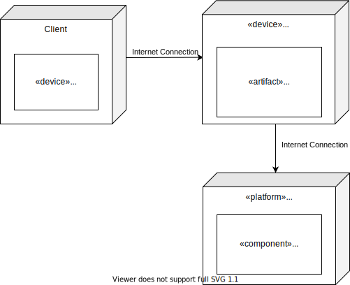
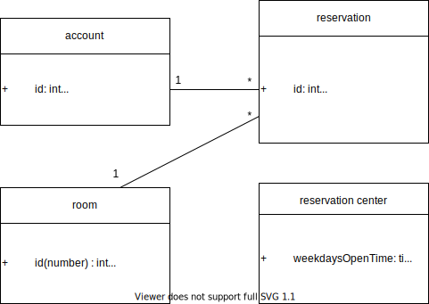

## Software Architecture Document

## 1. Introduction

### 1.1 Purpose

This document provides a comprehensive architectural overview of the system, using a number of different architectural views to depict different aspects of the system. It is intended to capture and convey the significant architectural decisions which have been made on the system.
We will introduce some of our functions in later chapters.

### 1.2 Scope

This document helps users to know more about our product, and can use this system more smoothly.

### 1.3 Definitions, Acronyms and Abbreviations

#####IIS: 
IIS stands for Internet Information Server, it is an integrated interface for managing various computer network services on Microsoft Windows Server.

### 1.4 References

Logical view:
Process view:
https://sceweb.uhcl.edu/helm/RationalUnifiedProcess/examples/csports/ex_sad.htm#Architectural%20Goals%20and%20Constraints

### 1.5 Overview

There are some sections included in this document, some are more important, such as Architectural Goals and Constraints, Use-case views, Logical view, and Process view. These sections help users to understand more about how our system works, and shows the structure of our system to the users.

## 2. Architectural Representation

This document presents the architectural as a series of views; use case view, process view, deployment view, and implementation view. There will be more detailed introductions and of our system in later chapters.

## 3. Architectural Goals and Constraints

The following are the four key requirements that have an important impact on system structure and safety:

1. The functions of this system need to be logged in through a google account.
2. This system provides the function of querying certain data, so the interface of the system must be able to bear a certain amount of flow.
3. Must ensure the security of all the customer account's privacy.
4. When developing the system structure, the load and performance requirements of the system must be considered.

有一些關鍵的要求和系統結構和安全性有重要的影響。分別為:
1.本系統的功能需要透過google帳號登入才能進行。
2.本系統提供查詢某些數據的功能，所以系統的接口必須能夠負擔一定的流量。
3.所有關於客戶帳號的隱私必須保證他們的安全性。
4.在開發體系結構時，必須考慮到系統的負載量及性能要求。

## 4. Use-Case View

This section lists the use cases which means significantly of our final system. 
The reservation System use cases are:
- User Login
- Manager Login
- Log out
- User Reserve Conference Room
- User Views Reserving Record
- User Cancels Room Reservation
- Maintain Reservation Information
- Maintain Reservation Record
- Maintain User Privileges

### 4.1 Use-Case Realizations

This section illustrates how the reservation system actually works by giving a few selected use-case realizations, and explains how the various design model elements contribute to their functionality.

|No.|Actor|Description|
|-----|--------|-----|
|1|User|A person who need to reserve a room 
|2|Manager|A manager who manages the overall room setting, user privileges and both user's and room's information|
|3|Participant|A person who use the reserved room which is reserved by the user|

**User Login**

**User Log out**

**User Reserves Conference Room**

**User Cancel Room Reservation**

**User Views Reserving Record**

**Manager Edits The Room's Overall Settings**

**Manager Search users**

**Manager Edits User's Privilges Settings**

**Manager views individual user's room reservation record**

## 5. Logical View
### 5.1 Overview

This section is for our system logic view. It describes the categories used in the system. It will also be divided into several packages, and describes the relationship and organization between the packages. It also contains the practical process of important use cases, and allows you to understand the relationship between the system's subsystems, packages and layers.

本節是對於我們系統logic view，描述了系統所用到的類別，還會分成好幾種包，並描述了各個包之間的關係與組織，還包含了重要的Use case的實踐過程，而且可以讓你了解本系統的子系統、package和layer之間的關係。

### 5.2 Architecturally Significant Design Packages

Our system mainly contains 5 main software packages, they are, respectively:

##### 1.Presentation
This package introduces the main structure of the communication between the user and the system, including various boundaries, and provides users with functions such as displaying pages, changing settings, searching for information, reserving, etc.

##### 2.Application
This package is mainly for the functions and architecture of the system's internal operations, including various controllers, providing the system to obtain data, create new data, send data to Google Calendar, update, disable or enable reservations and other functions.

##### 3.Domain
Including some room packages, reservation packages, account packages, reservation center packages。

##### 4.Persistence
Including the specific categories reserved by the system, in our design, only room data can be kept by the database.
##### 5.Services
Contains the categories used for system maintenance. Currently all of our maintenance is manual.

我們的系統主要包含5個主要軟件包
分別為:
1.Presentation
    本包為介紹使用者與系統通訊的主要架構，包含了各種的boundary，並提供使用者顯示頁面、變更設定、搜尋資料、預約等等的功能。
2.Application
    本包主要為系統內部本身運算的函式及架構，包含各種的controller，提供系統獲取資料、建立新資料、傳送data至google日曆、更新、disable或enable預約等功能。
3.Domain
    包含了一些room package、reservation package、account package、reservation center package。
4.Persistence
    包含系統保留特定的類別，在我們的設計上，只有room data得以被DB保留。
5.Services
    包含用於系統進行維護的類別，目前所有的維護都是手動的。

#### Logical View

#### Presentation Package

#### Application Package

#### Domain Package

#### Room package

#### Reservation package

#### Account package

#### Reservation Center package

### Persistence

## 6. Process View

This chapter mainly divides the processes into lightweight process (single threads of control) and heavyweight process (groupings of lightweight processes). Then they are classified and organized through the process of data connection or interaction, such as transmission, interruption and collection.
In terms of design, all application functions provided by our reservation system can be shown in the flowchart below. (Please refer to Application Package for application functions)

本章節主要將進程分成lightweight process(single threads of control)和heavyweight process(groupings of lightweight processes).然後透過資料的連結或交互的過程來將他們分類組織起來，像是傳遞、中斷和集合。
就以設計上來說，我們的預約系統提供的所有應用程序功能可以以下圖所示之流程圖。(應用程序功能請參見Application Package)

## 7. Deployment View

 The Client machine is any device capable of running a Web browser (most likely a PC, but not necessarily), and it is connected to the Internet Information Server. SQL is the database we use.

## 8. Implementation View

### 8.1 Overview

This is the overview of our system, there are three major layers: 
1. Sign in
2. Get Identity (User or Manager)
3. Functions

At first, the user enters the login page and log in to the system, the system will identify the user's ID, and display the user or manager's homapage. Then ,the user can choose which function to use.

### 8.2 Layers

##### Sign in
The subsystems include the user's homepage and manager's homapage.
After entering the homepage, the user could make different operations.

##### Get Identity(User or Manager)
After entering the homepage, user can choose to operate the function they want. 
If you are an general user, you can choose whether to reserve a room or to see your reservation records.

If you are a manager of the system, you can choose to go to the room setting interface, user setting interface, or to the recording interface. As a user, you can also go to the reservation page to reserve a room. 

##### Functions
When getting into the function part, user can complete in operating the functions.
## 9. Data View (optional)

This section is the description of the persistent data storage of the system. It implemented the attridutes and the logic of the data storage. 

## 10. Size and Performance
 The software as designed will support 1,000 concurrent users, due to lack of conference rooms for users to reserve.

   //Scaling beyond this level may be achieved by providing multiple levels of Pager Gateway, or by simply providing additional Pager Gateway systems within the same tier.//

## 11. Quality

The software as described above is built by IIS, SQL server database, and provides a self-describing user interface.
