# Software Requirements Specification

## Introduction

### Purpose

This document is written mainly to let the users understand how to use our project software, and it describes the functions, developing systems and the methods used in our
project. This document can also be used for the developers to maintain and modify the software, as it includes the whole structure of the system.
本文件主要是在描述我們專案的功能、開發系統及方法,以及讓使用者了解如何使用本專案的軟體,此外,本文件也適用於開發者的經營及維護,因為此文件包含了整體系統的架構。

<!--文件中的専有詞彙解釋 -->
### Glossary

### Intended Audience and Reading Suggestions

### Product Scope

This is a convenient reservation system of the conference room. By using our system, you can know about which periods the conference rooms are free, and can reserve it
immediately, so that you can avoid the situation of having no place to go when calling a meeting.
The main goal of our project is that we are able to let users reserve conference rooms, remind the users that the reserved date and time are around the corner, and show what the
reference rooms are equipped to the user, so that the user can choose the most appropriate room for them to use.
本專案主要是用於會議室的預約統,而使用本蒸統的好處為可以較為方便,迅速地知道何時有空間的會議室可供使用,並提供預約,以防要開會卻沒有會議室可用的窘境。
而本專案主要的目標為,可提供使用者預約會議室、可提醒使用者預約時間快到了,以及提供使用者各會議室的配備、設施,以供使用者選擇最適合自己的會議室。

### References

## Overall Description

### System Environment

* c#
  * asp.net
* sql server(microsoft)
* 

### Functional Requirements Definition

首先，下面這張圖是我們程式介面整體的流程，本節還依據每個使用者或管理員的不同操作預設了數種案例。

#### **2.2.1**
**User cases** 登入user (進入首頁)
**Diagram**

**Brief Description**
使用者登入本預約系統。
**Initial Step-By-Step Description**
在登入之前，使用者必須擁有google帳號，並access到我們的網頁了。
1. 使用者按下登入按鈕
2. 系統自動連結至google帳號
3. 連結至google帳號成功後進入user的主要頁面

**Xref:** Section 3.2.1 登入user (進入首頁)

### **2.2.2**
**User cases** 登入manager(進入首頁)
**Diagram**

**Brief Description**
管理員登入本預約系統。
**Initial Step-By-Step Description**
在登入之前，管理員必須擁有google帳號，並access到我們的網頁了。
1. 管理員按下登入按鈕
2. 系統自動連結至google帳號
3. 連結至google帳號成功後進入管理員的主要頁面

**Xref:** Section 3.2.2 登入manager(進入首頁)

### **2.2.3**
**User cases** 登出
**Diagram**

**Brief Description**
使用者或管理員欲離開本系統時，要做一個登出的動作。
**Initial Step-By-Step Description**
在登出之前，使用者或管理員需要已經登入我們的網頁了。
1. 使用者或管理員在系統中按下登出按鈕。
2. 系統回傳使用者系統回傳欲登出。
3. 登出成功後返回登入頁面。

**Xref:** Section 3.2.3 登出

### **2.2.4**
**User cases** 使用者借用會議室
**Diagram**

**Brief Description**
使用者欲借用會議室。
**Initial Step-By-Step Description**
在借用會議室之前，使用者需要已經登入我們的網頁了。
1. 使用者按下reserve按鈕。
2. 系統顯示reserve介面。
3. 使用者選擇會議室房號。
4. 系統提示確認該會議室是否為使用者需要。
5. 使用者確認。
6. 系統顯示可借用的日期與時間。
7. 使用者選擇還可借用的日期與時間，並依照使用者人數填上其他該會議室用戶的帳號。
8. 系統將該會議室的該段時間標註為已預約，並向其他會議室用戶發出確認函。
9. 其他用戶確認。
10. 系統提示成功預約。

**Xref:** Section 3.2.4 使用者借用會議室

### **2.2.5**
**User cases** user看借Room紀錄
**Diagram**

**Brief Description**
使用者欲看借會議室之紀錄。
**Initial Step-By-Step Description**
在查詢會議室紀錄之前，使用者需要已經登入我們的網頁了，並有相關的借用紀錄，才會找到該使用者的借用紀錄，否則會查無結果。
1. 使用者按下record按鈕。
2. 系統將該使用者的借用紀錄從database中調出
3. 系統顯示record介面。
4. 使用者可以觀看借用紀錄了。

**Xref:** Section 3.2.5 user看借Room紀錄

### **2.2.6**
**User cases** user取消Room預約
**Diagram**

**Brief Description**
使用者欲取消借會議室之預約。
**Initial Step-By-Step Description**
在取消借會議室之預約之前，使用者需要已經登入我們的網頁，並有在規定時間(1hr?)前執行取消的操作。
1. 使用者按下record按鈕。
2. 系統將該使用者的借用紀錄從database中調出
3. 系統顯示record介面。
4. 使用者可以觀看借用紀錄了。
5. 使用者按下記錄裡預約中的取消借用按鈕。
6. 系統將該會議室的該時段清除為未借用，並提示使用者成功取消。

**Xref:** Section 3.2.6 user取消Room預約

### **2.2.7**
**User cases** manager編輯Room整體設定
**Diagram**

**Brief Description**
管理者對於整體會議室的使用時段或描述做編輯。
**Initial Step-By-Step Description**
在管理者變更會議室資料之前，管理者需要已經登入我們的網頁，並且進入room settings的介面。
1. 管理者按下room settings按鈕。
2. 系統將整體的room的設定從database中調出。
3. 系統顯示整體的room settings介面。
4. 管理者對於整體的room settings做變更。
5. 管理者按下儲存變更的按鈕。
6. 系統將管理者所做的變更儲存，並提示管理者編輯成功。

**Xref:** Section 3.2.7 manager編輯Room整體設定

### **2.2.8**
**User cases** manager編輯單一Room設定
**Diagram**

**Brief Description**
管理者對於單一特定的會議室使用時段或詳細描述做編輯。
**Initial Step-By-Step Description**
在管理者變更會議室資料之前，管理者需要已經登入我們的網頁，並且進入room settings的介面。
1. 管理者按下room settings按鈕。
2. 系統將整體room的設定從database中調出。
3. 系統顯示整體的room settings介面。
4. 管理者選擇編輯單一room的詳細資料。
5. 系統將特定room的資料顯示給管理者。
6. 管理者對於特定room settings做變更。
7. 管理者按下儲存變更的按鈕。
8. 系統將管理者所做的變更儲存，並提示管理者編輯成功。

**Xref:** Section 3.2.8 manager編輯單一Room設定

### **2.2.9**
**User cases** 搜尋user
**Diagram**

**Brief Description**
管理者可以透過搜尋使用者來找到相關的帳號。
**Initial Step-By-Step Description**
管理者必須要已登入系統，且他所想要搜尋的使用者帳號必須存在。
1. 管理者按下user settings按鈕。
2. 系統將整體user的詳細資料從database中調出。
3. 系統顯示整體user settings介面。
4. 管理者選擇欲搜尋user的帳號或名字。
5. 管理者按下搜尋的按鈕。
6. 系統將管理者所搜尋到符合的項目列出，供管理者觀看。

**Xref:** Section 3.2.9 搜尋user

### **2.2.10**
**User cases** manager編輯User權限設定
**Diagram**

**Brief Description**
管理者對於使用者的權限進行設定或編輯。
**Initial Step-By-Step Description**
管理者必須要已登入系統，且他所想要編輯的使用者帳號必須存在。
1. 管理者按下user settings按鈕。
2. 系統將整體user的詳細資料從database中調出。
3. 系統顯示整體user settings介面。
4. 管理者選擇欲編輯user的詳細資料，並進行變更。
5. 管理者按下儲存變更的按鈕。
6. 系統將管理者所做的變更儲存，並提示管理者編輯成功。

**Xref:** Section 3.2.10 manager編輯User權限設定

### **2.2.11**
**User cases** manager看個別user借Room紀錄
**Diagram**

**Brief Description**
管理者可以透過搜尋使用者來找到相關的帳號。
**Initial Step-By-Step Description**
管理者必須要已登入系統，且他所想要搜尋的使用者帳號必須存在，且該帳號需要有相關借用紀錄，否則將會查無結果。
1. 管理者按下user settings按鈕。
2. 系統將整體user的詳細資料從database中調出。
3. 系統顯示整體user settings介面。
4. 管理者選擇欲搜尋user的帳號或名字。
5. 管理者按下搜尋的按鈕。
6. 系統將管理者所搜尋到符合的項目列出，供管理者觀看。
7. 管理者按下特定使用者的觀看借用紀錄按鈕。
8. 系統將該使用者的借用紀錄從database中取出，並顯示給管理者。

**Xref:** Section 3.2.11 manager看個別user借Room紀錄

### User Interface Specifications
下圖為整體程式架構圖，接下來此節會有詳細說明。

#### 共同的部分(使用者與管理者使用相同的介面)
##### **login page**
這個登入頁面會要求使用者或管理員藉由google帳號登入，會在畫面中央顯示。
##### **reserve interface**
畫面左側會顯示會議室的編號與詳細資料，供使用者挑選適合自己使用的會議室，而且會顯示該會議室的細節(設備提供)與限制(人數、時間)等，而畫面右側則會顯示指定會議室的日期、時間、與借用狀況，以供使用者選擇會議室空閒且自己有空的時間，並讓使用者輸入與自己一同使用會議室的人的帳號。
#### 使用者的部分(使用者才有的介面)
##### **user main page**
使用者的main page的預設畫面是home page，上方工作列的橫條選項分別依序是home、reserve、record、user info、logout。
##### **record interface**
使用者的record interface的功用為觀看自己帳號的歷史借用紀錄，畫面由左至右分別會顯示借用的詳細資料，依序為 使用者名稱、借用時間、會議室編號、會議室詳細資料、取消預約(需在時限內取消)，右上角有搜尋功能。
#### 管理者的部分(管理者才有的介面)
##### **manager main page**
管理者的main page的預設畫面是home page，上方工作列的橫條選項分別依序是home、reserve、record、room settings、user settings、user info、logout。
##### **record interface**
管理者的record interface的功用為觀看自己及整個系統的歷史借用紀錄，畫面由左至右分別會顯示借用的詳細資料，依序為 使用者名稱、借用時間、會議室編號、會議室詳細資料、取消預約(需在時限內取消)，右上角也有搜尋功能，在左上角多了一個switch，這可以切換要看自己的record或是觀看整個系統的record。
##### **user settings interface**
使用者設定管理介面主要功能為管理其他使用者的權限，右上角一樣有搜尋功能。
##### **room settings interface**
會議室設定管理介面主要功能為管理會議室的使用時間、限制使用人數、時段設定、會議室詳細資料的編寫(設備支援 有無插座、投影機...等)，右上角也有搜尋功能。
### Non-Functional Requirements

2. sql
  1. 定期備份
3. 驗證所有使用者輸入資料，避免 injection 攻擊
   1. email 格式符合
4. 避免使用者撈到原始碼
5. 避免使用者越權
5. 避免使用者進行非預期操作

## Requirements Specification

### External Interface Requirements

* 瀏覽器
* 網路
* Google 帳號

### Functional Requirements

詳細的 Functional Requirements Definition

## Other Nonfunctional Requirements

### Performance Requirements

|描述|
|每個載入畫面不超過3秒|
||

### Safety Requirements

* 使用者使用這網頁不會造成任何硬體上的損壞
* 請勿使用過久

### Security Requirements

3. 驗證所有使用者輸入資料，避免 injection 攻擊
   1. email 格式符合
4. 避免使用者撈到原始碼
5. 避免使用者越權
5. 避免使用者進行非預期操作

