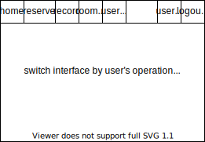
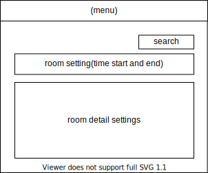

@import "Cover.md" 

## Table of Contents

[TOC]

## Introduction

### 1.1 Purpose

This document is written mainly to let the users understand how to use our project software, and it describes the functions, developing systems and the methods used in our project. This document can also be used for the developers to maintain and modify the software, as it includes the whole structure of the system.

### 1.2 Glossary

* ASP.NET
  ASP.NET is a free web framework that can be used to create great websites and web applications using HTML, CSS, and JavaScript. You can also create Web APIs and use real-time technologies such as Web communication terminals.

* SQL
  The language in which the database server interacts with humans or applications is called the SQL language. The so-called SQL language is Structured Query Language. Through this language (similar to programming syntax), we can easily and quickly perform actions such as adding, deleting, modifying, and querying data in the database.

* SQL Server
  SQL Server generally refers to a database server. SQL Server is already one of the most commonly used servers in the online world, because SQL Server and Web Server will be used by almost every person when they set up a website.

### 1.3 Intended Audience and Reading Suggestions

This section will suggest several reading methods due to the different roles of users reading this document.

If you are a **user without engineering background**, we recommend you to start reading from section 1.4 : Product Scope, then you can skip to section 2.2 : Functional Requirements Definition and section1 2.3 : User Interface Specifications to understand the user interface, and finally read section 4.2 : safty requirements to learn how to use this software safely.

If you are a **user with engineering background**, we recommend you to start reading from section 1.4 : Product Scope, then you can skip to section 2.1 : System Environment to understand the environment of the entire system, and then look at section 2.2 : Functional Requirements Definition and section 2.3 : User Interface Specifications to understand the user interface, and finally see section 4.2 : safty requirements to understand how to use this software safely.

If you are a **manager with no engineering background**, considering that you may need to maintain this system, we recommend you to read this document carefully from the beginning to the end, so that you understand all the principles and methods of the operations of the system, and also the architecture and requirements of the system.

If you are a **manager with engineering background**, considering that you may need to maintain this system, we recommend you to read section 2.1 : System Environment to understand the environment of the entire system, and then read section : 2.2 Functional Requirements Definition and section 2.3 : User Interface Specifications to understand the overall flow of the user interface and some user cases. 

If you need to go deep into user cases, section 3.2 : Functional Requirements will be a good choice for you. In addition, section 4.1 : Performance Requirements and section 4.3 : Security Requirements will be an important consideration, so please read these sections carefully .

### 1.4 Product Scope

This is a convenient reservation system of the conference room. By using our system, you can know about which periods the conference rooms are free, and can reserve it immediately, so that you can avoid the situation of having no place to go when calling a meeting.

The main goal of our project is that we are able to let users reserve conference rooms, remind the users that the reserved date and time are around the corner, and show what the reference rooms are equipped to the user, so that the user can choose the most appropriate room for them to use.

### 1.5 References

* ASP.NET
  * https://zh.wikipedia.org/wiki/ASP.NET
  * https://docs.microsoft.com/zh-tw/aspnet/overview
* SQL Server
  * https://www.raidenhttpd.com/manual/sql-server.html
  * https://zh.wikipedia.org/wiki/Microsoft_SQL_Server

## 2. Overall Description

### 2.1 System Environment

We will use ASP.NET to create our website, and the language we use is C#. Also, we will use SQL Server from Microsoft to build our web, we'll use it to save data.

The following are our system functions:
  * Manager / User login
  * Manager managing users
  * Manager managing booking records
  * Manager search users / booking records
  * Manager giving users authority
  * User reserving conference rooms
  * User cancel booking
  * System reminds user about their reservation time

System interface:
  There will be a few kinds of interfaces, we'll introduce it more at Chapter 3.1

  * Login interface 
  * Reserving interface
  * Logout interface

The following are the Non-interactive operations and the Back-up and Recovery methods of our system :

* Non-interactive operation:
  The system will send an e-mail to the user to remind him / her that the time the user booked is coming soon.

* Back-up and Recovery:
  For this part, we'll use Google's GCP service to back-up all the data every fixed period. (ex: 1 month)

### 2.2 Functional Requirements Definition

First of all, the following picture is the overall flow chart of our program interface. This section also manuals several cases based on the different operations of each user or manager.

#### 2.2.1 Use case: User login (Enter homepage) 

**Diagram**

**Brief Description**
User logs in this reservation system. 

**Initial Step-By-Step Description**
Before logging in, the user is required to have a Google account, and the account has already had access to our website.

1. User presses the login button. 
2. The system connects to the google account automatically 
3. After connecting to user's google account, user succeeds in entering user's homepage. 

**Xref:** Section 3.2.1  User login (Enter homepage) 

#### 2.2.2 Use case Manager login (Enter homepage) 

**Diagram**

**Brief Description**
Manager logs in this reservation system. 

**Initial Step-By-Step Description**
Before logging in, the manager is required to have a Google account, and the account has already had access to our website.
1. Manager presses the login button  
2. The system connects to the google account automatically. 
3. After connecting to the manager's google account, the manager succeeds in entering manager's homepage. 

**Xref:** Section 3.2.2 Manager login (Enter homepage) 

#### 2.2.3 Use case: Log out 

**Diagram**

**Brief Description**
When the user or manager wants to leave the system, they need to log out first.
 
**Initial Step-By-Step Description**
Before logging out, the user or manager needs to have logged in to our web page.  
1. The user or manager presses the logout button in the system. 
2. The system returns that the user / manager wants to log out.
3. After successfully logging out, system returns to the login page. 

**Xref:** Section 3.2.3 Log out 

#### 2.2.4 Use case: User reserve conference room. 

**Diagram**

**Brief Description**
User wants to reserve a conference room.

**Initial Step-By-Step Description**
Before reserving the conference room, the user needs to have logged in to our webpage.  
1. The user presses the reserve button.  
2. The system displays the reservation interface. 
3. The user selects the conference room number. 
4. The system prompts to confirm whether the meeting room is required by the user. 
5. User confirms. 
6. The system displays the available date and time. 
7. The user selects the date and time that can be reserved, and fills in the accounts of other meeting room users according to the number of users.  
8. The system will mark this period of time in the conference room as "reserved", and send a confirmation email to other users of this conference room.  
9. Other users confirm. 
10. The system prompts that the reservation is successful.

**Xref:** Section 3.2.4  User reserve conference room. 

#### 2.2.5 Use case: User views reserving record.

**Diagram**

**Brief Description**
User wants to view one's own reserving record. 

**Initial Step-By-Step Description**
Before querying the conference room record, the user needs to have logged in to our webpage and needs to have relevant reserving records, otherwise there will be no results. 
1. The user presses the record button.
2. The system searches the reserving record of the user from the database.
3. The system displays the record interface. 
4. The user can view the historical reserving record. 

**Xref:** Section 3.2.5 User views reserving records. 

#### 2.2.6 Use case: User cancels room reservation. 

**Diagram**

**Brief Description**
User wants to cancel the room's reservation.  

**Initial Step-By-Step Description**
Before canceling the reservation of the conference room, the user needs to log in to our webpage and perform the cancellation operation before the specified time. (1 hour before the reserved time) 
1. The user presses the record button. 
2. The system searches the reservation record of the user from the database. 
3. The system displays the record interface. 
4. The user can view the reservation records. 
5. The user presses the "cancel reservation button" in the record. 
6. The system clears the period of the conference room as unreserved and prompts the user that the cancelation succeeds. 

**Xref:** Section 3.2.6  User cancels room reservation. 

#### 2.2.7 Use case: Manager edits the room's overall settings 

**Diagram**

**Brief Description**
The manager edits the usage period or the overall description of the conference room. 

**Initial Step-By-Step Description**
Before the manager changes the meeting room information, the manager needs to have logged in to our webpage and entered the room settings interface. 

1. The manager presses the room settings button. 
2. The system recalls the overall room settings from database. 
3. The system displays the overall room settings interface. 
4. The manager makes changes to the overall room settings. 
5. The manager presses the save button to save the changes. 
6. The system saves the changes made by the manager, and prompts the manager that the edit is successful. 

**Xref:** Section 3.2.7 Manager edits the room's overall settings 

#### 2.2.8 Use case: Manager edits a single room's settings 

**Diagram**

**Brief Description**
The manager edits the usage period or detailed description of a single specific conference room. 

**Initial Step-By-Step Description**
Before the manager changes the meeting room information, the manager needs to have logged in to our webpage and entered the room settings interface. 
1. The manager presses the room settings button. 
2. The system recalls the overall room settings from the database. 
3. The system displays the overall room settings interface. 
4. The manager chooses to edit the details of a single room. 
5. The system displays the information of a specific room to the manager. 
6. The manager makes changes to the specific room's settings. 
7. The manager presses the save button to save the changes. 
8. The system saves the changes made by the manager, and prompts the manager that the edit is successful.

**Xref:** Section 3.2.8 Manager edits a single room's settings

#### 2.2.9 Use case: Search users 

**Diagram**

**Brief Description**
Manager can find related accounts by searching users. 

**Initial Step-By-Step Description**

The manager must have logged in to the system, and the user account he / she wants to search must exist. 
1. The manager presses the user settings button.
2. The system calls out the detailed information of the overall user from the database. 
3. The system displays the overall user settings interface. 
4. The manager types in the account or name of the user to be searched. 
5. The manager presses the search button. 
6. The system lists the matching accounts searched by the manager for the manager to watch. 

**Xref:** Section 3.2.9 Search users 

#### 2.2.10 Use case: Manager edits user's authority settings 

**Diagram**

**Brief Description**
The manager sets or edits user's authority.

**Initial Step-By-Step Description**
The manager must have logged in to the system, and the user account he / she wants to edit must exist. 
1. The manager presses the user settings button. 
2. The system calls out the detailed information of the overall user from the database. 
3. The system displays the overall user settings interface. 
4. The manager selects the user's details to be edited and makes changes. 
5. The administrator presses the save button to save the changes.  
6. The system saves the changes made by the manager, and prompts the manager that the edit is successful 

**Xref:** Section 3.2.10 Manager edits the user's authority settings  

#### 2.2.11 Use case: Manager views individual user's room reservation record. 

**Diagram**

**Brief Description**
Managers can find related accounts by searching users. 

**Initial Step-By-Step Description**
The manager must have logged in to the system, and the user account he wants to search must exist, and the account must have a related reserving record, otherwise there will be no results. 
1. The manager presses the user settings button.  
2. The system calls out the detailed information of the overall user from the database. 
3. The system displays the overall user settings interface.
4. The administrator types in the account or name of the user to be searched. 
5. The manager presses the search button.  
6. The system lists the matching accounts searched by the manager for the manager to watch. 
7. The manager presses the viewing button of the reserving record of the specific user. 
8. The system takes out the reserving record of the user from the database and displays it to the manager.

**Xref:** Section 3.2.11 Manager views individual user's room reservation record.

### 2.3 User Interface Specifications

The following figure is the overall structure diagram of our program, which will be explained in detail in this section. 

#### Common parts (user and manager use the same interface) 

* ##### **login page**

  This login page will require users or managers to log in with a Google account and will be displayed in the center of the screen. 

  

* ##### **reserve interface**

  The number and detailed information of the conference room will be displayed on the left side of the screen, so users can choose the room which is suitable for their use.  Also, the details (equipment provided) and restrictions (max / min number of people, time) of the conference room will be displayed. 

  The right side of the screen will display the date, time, and reserving status of the conference room, so that the user can choose the time when the conference room is free, and let the user enter the account of all the people who uses the conference room with him. 

  
  
#### User parts (interface only available to users) 

* ##### **user main page**
  The default screen of the user's main page is the homepage, and the horizontal taskbar on the top of the page are home, reserve, record, user info,and logout, respectively.

  

*  ##### **record interface**
   
   The function of the user's record interface is to view the historical reserving records of their own account. The screen will display the detailed reserving information from left to right, followed by the user name, reserving time, conference room number, meeting room details, and canceling appointments. (Need to cancel within the time limit). There is a search function in the upper right corner of the page.

    
   
#### Manager parts (interface only available to managers)  

* ##### **manager main page**

  The default screen of the manager's main page is the homepage, and the horizontal taskbar on the top of the page are home, reserve, record, room settings,user settings,user info, and logout, respectively.

  

* ##### **record interface**

  The function of the manager’s record interface is to view the historical reserving records of oneself and the entire system. The detailed information of the borrowing will be displayed from left to right on the screen, followed by the user name, reserving time, conference room number, conference room details, cancel the appointment. (need to cancel within the time limit) There is also a search function in the upper right corner, and there is a switch button on the upper left corner, which can switch to watch your own records or watch the records of the entire system.

  

  
* ##### **user settings interface**

  The main function of the user setting management interface is to manage the authority of other users, and there is also a search function in the upper right corner.

  
  

* ##### **room settings interface**

  The main function of the conference room setting management interface is to manage the usage time of the conference room, the limit the number of users, time settings, and edit detailed information of the conference room (equipments that are available, whether there are charging socket or projectors, etc.). There is also a search function in the upper right corner.

  

### 2.4 Non-Functional Requirements

This section illustrates the non-functional requirements which includes the backup of database, security and reliability. 

* The backup of database
  As the database is created by using SQL Server, to avoid missing data while the database errors occured it take once backup every month.

* Security
  1. User identity verification, to avoid injection attack
      * The user must input the correct format of the email address as verifing user identity.
  2. Avoid user access to the source code
  3. Avoid privilege escalation
     
* Reliability 
  By the user operating unexpected action, serious errors may occured. The system is reliable to avoid unexpected user operations.

## 3.Requirements Specification

### 3.1 External Interface Requirements

The external interfaces that would be used are:
* Browser
  * Our project is a website
* Internet
  * User has to have access to the Internet to use our reservation system
* Google account
  * Our system requires users to use Google accounts to log into the system

Other interfaces are software interfaces, which are developed in our system.
We had already introduced them briefly in Chapter 2.1, the following are the more detailed introductions: 

* Login interface 
  * Use google account to login
* Reserving interface
  * Lists details of every conference room
  * Requires user to enter all participants' email address
  * Show calander to user to let him / her choose the date
  * After date is chosen, system shows the available time
  * Press "Confirm" after filling up all the details
* Logout interface
  * There will be an logout button of the right-top of every other interfaces
  * After logging out, the web goes to the Google login page.

### 3.2 Functional Requirements

#### 3.2.1 User login (Enter homepage)

|Use case ID|1|
|-----|--------|
|Use Case Name|User login (Enter homepage)|
|Actors|User, reservation system, google login system|
|Description|User logs in this reservation system.|
|Trigger|User enters login page|
|Preconditions|1. User is required to have a Google account.  2. The account has already had access to our website.|
|Postconditions|User completes logging in the system|
|Normal Flow|1. User presses the login button. 2. The system connects to the google account automatically 3. After connecting to user's google account, user succeeds in entering user's homepage. |

#### 3.2.2 Manager login (Enter homepage)

|Use case ID|2|
|-----|--------|
|Use Case Name|Manager login (Enter homepage)|
|Actors|Manager, reservation system, google login system|
|Description|Manager logs in this reservation system.|
|Trigger|Manager enters login page|
|Preconditions|1. Manager is required to have a Google account. 2.The account has already had access to our website.|
|Postconditions|Manager completes logging in the system|
|Normal Flow|1. Manager presses the login button. 2. The system connects to the google account automatically 3. After connecting to manager's google account, user succeeds in entering manager's homepage. |

#### 3.2.3 Log out

|Use case ID|3|
|-----|--------|
|Use Case Name|Log out|
|Actors|User / Manager, reservation system, google login system|
|Description|When the user or manager wants to leave the system, they need to log out first|
|Trigger|User / Manager presses the logout button|
|Preconditions|User or manager needs to have logged in to our web page. |
|Postconditions|User / Manager completes logging in the system|
|Normal Flow|1. The user or manager presses the logout button in the system.  2. The system returns that the user / manager wants to log out.  3. After successfully logging out, system returns to the login page.|

|Use case ID|4|
|-----|--------|
|Use Case Name|User reserve conference room|
|Actors|User, reservation system|
|Description|User wants to reserve a conference room.|
|Trigger|User presses the reserve button|
|Preconditions|The user needs to have logged in to our webpage.|
|Postconditions|The user completes reserving a conference room.|
|Normal Flow|1. The user presses the reserve button. 2.  The system displays the reservation interface.  3. The user selects the conference room number. 4. The system prompts to confirm whether the meeting room is required by the user. 5. User confirms. 6. The system displays the available date and time.  7. The user selects the date and time that can be borrowed, and fills in the account of other meeting room users according to the number of users. 8. The system will mark this period of time in the meeting room as "reserved", and send a confirmation email to other conference room users. 9. Other users confirm. 10. The system prompts that the reservation is successful.|

|Use case ID|5|
|-----|--------|
|Use Case Name|User views reserving record.|
|Actors|User, Reservation system|
|Description|User wants to view one's reserving record.|
|Trigger|The user presses the record button.|
|Preconditions|1. User needs to have logged in to our webpage. 2. User needs to have relevant reserving records.|
|Postconditions|System displays reserving record to user.|
|Normal Flow|1. The user presses the record button. 2. The system searches the reserving record of the user from the database. 3. The system displays the record interface.  4. The user can view the historical reserving record.|

|Use case ID|6|
|-----|--------|
|Use Case Name|User cancels room reservation.|
|Actors|User, Reservation system|
|Description|User wants to cancel the room's reservation.|
|Trigger|User presses the cancel reservation button after pressesing the record button.|
|Preconditions|1.User needs to log in to our webpage.  2. The time must be at least an hour before the reserved time.  3. User must have reserved a conference room before cancling it.(Or there will be no reservations to be canceled.)|
|Postconditions|User completes canceling reservation.|
|Normal Flow|1. The user presses the record button. 2. The system searches the reservation record of the user from the database. 3. The system displays the record interface. 4. The user can view the reservation record. 5. The user presses the "cancel reservation button" in the record. 6. The system clears the period of the conference room as unreserved and prompts the user that the cancelation succeeds.|

|Use case ID|7|
|-----|--------|
|Use Case Name|Manager edits the room's overall settings|
|Actors|Manager, Reservation system|
|Description|The manager edits the usage period or the overall description of the conference room.|
|Trigger|The manager presses the room settings button.|
|Preconditions|1. Manager needs to have logged in to our webpage. 2. Manager needs to have entered the room settings interface.|
|Postconditions|Manager completes editing the room's overall settings|
|Normal Flow|1. The manager presses the room settings button.  2. The system recalls the overall room settings from database. 3. The system displays the overall room settings interface. 4. The manager makes changes to the overall room settings. 5. The manager presses the save button to save the changes. 6. The system saves the changes made by the manager, and prompts the manager that the edit is successful.|

|Use case ID|8|
|-----|--------|
|Use Case Name|Manager edits a single room's settings|
|Actors|Manager, Reservation system|
|Description|The manager edits the usage period or detailed description of a single specific conference room.|
|Trigger|The manager selects a specified room after pressing the room settings button.|
|Preconditions|1. The manager needs to have logged in to our webpage. 2. Manager needs to have entered the room settings interface.|
|Postconditions|Manager completes editing a specific conference room's settings.|
|Normal Flow|1. The manager presses the room settings button. 2. The system recalls the overall room settings from the database. 3. The system displays the overall room settings interface. 4. The manager chooses to edit the details of a single room. 5. The system displays the information of a specific room to the manager. 6. The manager makes changes to specific room's settings. 7. The manager presses the save button to save the changes. 8. The system saves the changes made by the manager, and prompts the manager that the edit is successful.|

|Use case ID|9|
|-----|--------|
|Use Case Name|Search users|
|Actors|Manager, Reservation system|
|Description|Manager can find related accounts by searching users.|
|Trigger|Manager types in the name of the user to be searched and presses the search button.|
|Preconditions|1.The manager must have logged in to the system.  2. The user account that the manager wants to search must exist.|
|Postconditions|Manager completes searching the user and views the user's account.|
|Normal Flow|1. The manager presses the user settings button.  2. The system calls out the detailed information of the overall user from the database. 3. The system displays the overall user settings interface. 4. The manager types in the account or name of the user to be searched. 5. The manager presses the search button. 6. The system lists the matching accounts searched by the manager for the manager to watch.|

|Use case ID|10|
|-----|--------|
|Use Case Name|Manager edits user's authority settings|
|Actors|Manager, Reservation system|
|Description|The manager sets or edits user's authority.|
|Trigger|The manager chooses the user account to be edited after pressing the user settings button.|
|Preconditions|1. The manager must have logged in to the system. 2. The user account that the manager wants to edit must exist.|
|Postconditions|Manager completes editing user's authority.|
|Normal Flow|1. The manager presses the user settings button. 2. The system calls out the detailed information of the overall user from the database. 3. The system displays the overall user settings interface. 4. The manager selects the user's details to be edited and makes changes. 5. The administrator presses the save button to save the changes. 6. The system saves the changes made by the manager, and prompts the manager that the edit is successful. |

|Use case ID|11|
|-----|--------|
|Use Case Name|Manager views individual user's room reservation record|
|Actors|Manager, Reservation system|
|Description|Managers can find related accounts by searching users.|
|Trigger|The manager chooses the user account and presses the view button after pressing the user settings button.|
|Preconditions|1. The manager must have logged in to the system. 2. The user account that the manager wants to search must exist. 3. The account to be searched must have a related reserving record.|
|Postconditions|System displays the user's reservation records to the manager.|
|Normal Flow|1. The manager presses the user settings button. 2. The system calls out the detailed information of the overall user from the database. 3. The system displays the overall user settings interface. 4. The administrator types in the account or name of the user to be searched. 5. The manager presses the search button. 6. The system lists the matching accounts searched by the manager for the manager to watch. 7. The manager presses the viewing button of the reserving record of the specific user.  8. The system takes out the reserving record of the user from the database and displays it to the manager.|

## 4. Other Nonfunctional Requirements

### 4.1 Performance Requirements

The reservation system must load in a first speed to avoid user being waited for too long. As the sentences listed below are the standard requirements for the loading speed of the system. All connections' or loading's speed must be less than 10 seconds. Every booking submission and modification should be updated in the common database within 3 seconds after each submission and modification activity. Loading the announcement about the reservation website within 3 seconds. Results for the availability of each room within 10 seconds. After confirming the reservation of the booking, the system redirects to the main page within 3 seconds. Confirmation email shall be sent into the user's mentioned email within 1minute after confirmation page termination.

### 4.2 Safety Requirements

This system is based on the website servers. That is, to make sure the system work smoothly it has a period of time for every user who need to book a room. The system will check whether the user is performing any activities on the reservation page, over 10 minutes without performing any activities the system will let that user log out automatically.

Furthermore, this website is safe for every user which makes no damage for any hardware or software equirements. It should have no virus as sending confirmed email or operating over the website. 

The database is the most important section of this system. The database should be carefully maintained by the administrator any loss may lead to chaos. The system protects the information of user and database and let no one to access any of its information.

### 4.3 Security Requirements

This system have high quality security system. For the user identity verificaion, to avoid injection attack the system will request the user to input the correct format of the emaill address as verifiing user identity. Before confirmed the booking of the room the host must input the numbers of paticipants and their email, notice them to confirm the reservation. The reservation will be canceled by the system if there have no one confirmed.

To protect the database of the system, the security system have to avoid the user access the source code without permission. Moreover, avoid privilege escalation is also a important section of security system. The administrator must not give the normal user high authority. Also, the system have no bug to let the user use privilege escalation for attracking the system. 

As the administrator manages both database and reservation of the system, the account and password of the administrator must be highly confidential to avoid data accessed by anyone. It have a hidden option for the administrator to log in. 
