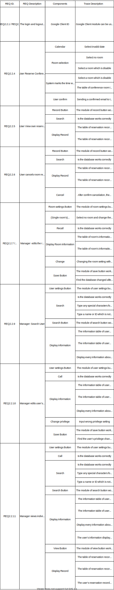

@import "Cover.md" 

## Table of Contents

[TOC]

## 1. Introduction

### 1.1 Purpose

<!-- 此文件的目的是用來描述我們的meeting room reservation system的整體架構，以及裡面細部的內容，系統內各部的objects的詳細功能、function的詳細作用及部分原碼，因此，此文件主要是用來給有工程背景的使用者或是管理者觀看的，當然，若你沒有工程背景，也歡迎閱讀此份文件並可以從中了解到部分系統的原理及架構。 -->

The purpose of this document is to describe the overall structure of our meeting room reservation system, as well as the detailed content inside of the system, the detailed functions of the objects in the system, and the detailed functions of different functions, and part of the original code. Therefore, this document is mainly used for users or managers with engineering background. Of course, if you don’t have engineering background, you are welcome to read this document and learn about the principles and architecture of the system.

### 1.2 Scope

<!-- 本meeting room reservation system的目的是為了讓需要使用會議室的人可以採用線上預約的方式進行，從而省下許多不必要的流程，如大老遠的通車就為了當面預約會議室，還有可能遇到客滿而撲空，用了本系統後就可以避免這種狀況，既節省人力又節省時間。 -->

The purpose of this meeting room reservation system is to allow people who need to use the meeting room to make online reservations, thus saving many unnecessary procedures. For example, spending lots of time commuting just to reserve meeting rooms in person, and there may be times when all rooms are full , this situation can be avoided after using this system, which saves both manpower and time.
## test.2
### 1.3 Overview
<!-- 
本文件的
第一章Introduction主要是拿來介紹本文件的章節，以及一些參考文件及名詞解釋
第二章System Overview是本系統的簡介
第三章System Architecture是介紹系統內部的主要架構，內部包含一些model的視覺化圖形來幫助理解，如ER model。
第四章Data Design是用來介紹本系統的資料結構設計。
第五章Component Design是用來介紹一些內部的function(含程式碼)、object的作用。
第六章Human Interface Design是用來介紹一些系統的UI、使用者介面的圖形。
第七章Requirements Matrix是一些系統的需求，將會以表格的形式呈現。 -->

The following is the overview of this document:

#### Chapter 1 Introduction

This chapter is mainly used to introduce the chapters of this document, and some reference documents and explanations of terms.

#### Chapter 2 System Overview 

This chapter is an introduction to the system.

#### Chapter 3 System Architecture 

This chapter is used to introduce the main internal architecture of the system, which contains some visual graphics of the model to help users understand, such as the ER model.

#### Chapter 4 Data Design 

This chapter is used to introduce the data structure design of this system.

#### Chapter 5 Component Design

This chapter is used to introduce some internal functions (including code) and the role of objects.

#### Chapter 6 Human Interface Design

This chapter is used to introduce some system UI and user interface graphics.

#### Chapter 7 Requirements Matrix

This chapter shows some system requirements, which will be presented in the form of tables.

### 1.4 Reference Material
<!-- 
這裡有兩份額外的文件，如果你對於本系統有興趣的話，也可以去看看。 -->

There are two extra files here, if you are interested in this system, you can also check it out.

1. SRS document.[<text>[1]</text>](#15-definitions-and-acronyms)
2. Architecture document.

### 1.5 Definitions and Acronyms

1. SRS document: SRS doucment is a software requirements specification (SRS) helps you lay the groundwork for product development.[1]

## 2. System Overview

##### Functional Analysis
<!-- 
Input:蒐集使用者對本系統欲執行動作的指令，如按按鈕、輸入資料等.
Output:根據使用者的行為進行相對應的資料呈現、預約等process. -->

Input: Collect the commands that users want to perform actions on the system, such as pressing buttons, inputting data, etc.

Output: According to the user's behavior, the corresponding data presentation, appointment and other processes are carried out.

##### Process

<!-- * 使用者查詢借用資料
* 使用者(管理層)查詢所有使用者借閱資料
* 調出借用資料
* 使用者取消預約
* 判斷能否取消(是否在時限內)
* 使用者借用會議室
* 判斷會議室能不能借(人數限制是否符合)
* 使用者(管理層)變更其他使用者的權限
* 判斷是否有權限變更該使用者
* 使用者(管理層)變更房間的設定 -->

* User query reservation information
* User (management level) queries all user reserving data
* Recall reserved data
* User cancels reservation
* Determine whether cancel reservation or not (whether it is within the time limit)
* User reserves reference room
* Determine whether the reference room can be borrowed or not (whether the number of people meets the limitation)
* The user (management level) changes the authority of other users
* Determine whether one has the  authority to change the user's authority
* The user (management level) changes the room settings

##### Modules

<!-- 根據本系統的功能，我們可以將模塊分成以下五種: -->
According to the functions of this system, we can divide the modules into the following five types:

1. login module
2. reservation module
3. record module
4. setting module
5. exit module

**login module**
<!-- 讓使用者登入的模塊。 -->
The module that allows users to log in.

**reservation module**
<!-- 可供使用者預約會議室的模塊、裡面包含了會議室編號、日期、時間、參與人等資料。 -->
A module for users to reserve a reference room, which contains the reference room's ID number, date, time, attendees and other information.

**record module**
<!-- 可供使用者查詢借用紀錄的模塊、裡面包含了讓使用者取消的功能。 -->
A module for users to inquire about reserving records, which includes the function that allow users to cancel.

**setting module**
<!-- 管理員專用，可供管理員設定房間資料、使用者權限編輯的模塊。 -->
Only for managers, it is a module for managers to set room data and user's authority.

**exit module**
<!-- 讓使用著登出的模塊。 -->
The module that allows users to log out.

## 3. System Architecture

### 3.1 Architectural Design

### 3.2 Decomposition Description

**Data Flow Diagram:**

**level 0:**

**level 1:**

**level 2:**

### 3.3 Design Rationale

In section 3.1, we can see that there are four main entities. According to these four entities, users can know the architecture of the entire system more easily. Through the diagram in section 3.1, users can also know the attributes of each entity very easily, and could infer that what kind of data the system will need when the system is operating, and how the entire system works, too. We think it would be more convinient for users to get familiar with our system.

## 4. Data Design

This section describes the category of data required by the system. The data listed below showed the entity relationship of the system.

### 4.1 Data Description

This section explain how the information domain of the system is transformed into data structures. It also show the major data such as database and data storage items used in system. 

* A List of Room including:
    * Room number (Room ID)
    * The maximum number of total attendees
    * The minimum number of total attendees
    * The condition of the room (enable or disable)
* The information about the reservation center:
    * The open hours during weekdays
    * The closed hours during weekdays 
    * The open hours during weekend
    * The closed hours during weekend
* The information about the room that user reserved:
    * Room number (Room ID)
    * The password of the Room
    * Reservation's date and time
    * The rules of the room
* The information of Reservation made:
    * User's Name
    * attendees' email
    * Room number (Room ID)
    * Date and Time of the reservation
    * The Number of attendees
    * Duration
* User Information, most importantly containing:
    * Google client ID
    * User's Room reservation records
    * User Privilege 
* Manager Information, most importantly containing:
    * Manager Google client ID
    * Manager Privilege

### 4.2 Data Dictionary

This section list the major data of the system by a table. As the table listed below describes the field name, data type, data format, field size, description and is it accepts null value.

**Account**
| Field Name | Data Type | Data Format | Field Size | Description | Accepts null value? | 
|------------|-----------|-------------|------------|-------------|---------------------|
| id | String | OOOOOOOO-OOOO-OOOO-OOOO-OOOOOOOOOOOO | 128 | The id of the user| N |
| privilege | Int | <text> </text> | 16 bit | Defined the user's privilege | N |
| email | String | OOO@OOO.OOO | 128 | Defined the user's email | N |
| name | String | <text> </text> | 256 | Defined the user's name | N |

**Room**
| Field Name | Data Type | Data Format | Field Size | Description | Accepts null value? | 
|------------|-----------|-------------|------------|-------------|---------------------|
| id | Int | <text> </text> | 16 bit | The id of the room | N |
| maxNumber_of_users | Int | <text> </text> | 16 bit | The maximum number of total attendees | N |
| minNumber_of_users | Int | <text> </text> | 16 bit | The minimum number of total attendees | N |
| enable | Bool | <text> </text> | <text> </text> | The room is enable or disable | N |

**Reservation**
| Field Name | Data Type | Data Format | Field Size | Description | Accepts null value? | 
|------------|-----------|-------------|------------|-------------|---------------------|
| id | int | <text> </text> | 128 | The id of this reservation| N |
| user_id | String | OOOOOOOO-OOOO-OOOO-OOOO-OOOOOOOOOOOO | 128 | The id of the user| N |
| room_id | Int | <text> </text> | 16 bit | The id of the room | N | 
<<<<<<< HEAD
| participantsEmail | String | OOO@email.com;OOO@email.com.. | 1280 | The participants' email | Y |
| session | int | <text> </text> | 8 bit | a period of time arranged for the reservation | N |
| date | date | yyyy-MM-dd | <text> </text> | The date of the reservation | N |
=======
| attendeesEmail | String | OOO@email.com;OOO@email.com.. | 1280 | The attendees' email | Y |
| session | int | <text> </text> | 8 bit | a period of time arranged for the reservation預約的時段 | N |
| date | date | yyyy-MM-dd | <text> </text> | The date of the reservation預約的時段 | N |
| duration | date | yyyy-MM-dd | <text></text> | The duration of the reservation | N |
>>>>>>> c071e859268fd57e5d4d8498181323b1848883db
| disable | Bool | <text> </text> | <text> </text> | The room is enable or disable | N |

**Reservation_Center**
| Field Name | Data Type | Data Format | Field Size | Description | Accepts null value? | 
|------------|-----------|-------------|------------|-------------|---------------------|
| weekdays_open_time | time | hh:mm:ss.fffz | <text> </text> | The open hours of the reservation center during weekdays | N |
| weekdays_close_time | time | hh:mm:ss.fffz | <text> </text> | The close hours of the reservation center during weekdays | N |
| weekdend_open_time | time | hh:mm:ss.fffz | <text> </text> | The open hours of the reservation center during weekend | N |
| weekdend_close_time | time | hh:mm:ss.fffz | <text> </text> | The close hours of the reservation center during weekend | N |
<<<<<<< HEAD
| time_per_time_period | time | hh:mm:ss.fffz | <text> </text> | The length of every period of time  | N |
=======
| duration | time | hh:mm:ss.fffz | <text> </text> | The length of duration 每個時段的時間長度 | N |
>>>>>>> c071e859268fd57e5d4d8498181323b1848883db

## 5. Component Design
<!-- [張家菁]
In this section, we take a closer look at what each component does in a more systematic way. If you gave a functional description in section 3.2, provide a summary of your algorithm for each function listed in 3.2 in procedural description language (PDL) or pseudocode. If you gave an OO description, summarize each object member function for all the objects listed in 3.2 in PDL or pseudocode. Describe any local data when necessary. -->

@import "5/Reservation.html"
@import "5/Account.html"
@import "5/Room.html"

## 6. Human Interface Design

[張家菁]

### 6.1 Overview of User Interface

<!--  -->
<!-- Describe the functionality of the system from the user’s perspective. Explain how the user
will be able to use your system to complete all the expected features and the feedback
information that will be displayed for the user. -->

**Login**
<!-- 使用者的登入頁面
檢視任何需要登入才能進入的頁面
皆會被切回此頁面
<<<<<<< HEAD
登入後即導回原頁面 -->

User Login Interface 
When viewing any interfaces that requires the user to login, the system will display the User Login Interface to let the user login.
After the user logs in sucessfully, the website will lead the user to the origin webpage.
=======
登入後即導回原頁面

User Login Interface
View any interface that need user to login
After any action is done successfully will lead the user back to this interface
After login successfully, the website will lead the user back to the main page
>>>>>>> c071e859268fd57e5d4d8498181323b1848883db

**Home**
<!-- 已登入使用者才可以檢視，為此系統的介紹頁面。 -->

An interface introducing the system, only allowing the users who have logged in to access.

**Reserve**
<!-- 已登入使用者才可以檢視，使用者借會議室的頁面
點選會議室時，會發get request給後端，後端回應對應的會議室的預約狀況。
切換時，會發get request給後端，後端回應對應的日期的預約狀況。
按下submit後，會發post request給後端，後端會依據選取的資訊，在資料庫中新增預約紀錄。
 -->

<<<<<<< HEAD
The interface that user reserves a conference room , only allowing the users who have logged to access.
After the user selected the conference room, it will send "get request" to the server side, the server side will reply for the reservation conditions of the meeting room selected by the user.
=======
The interface that user reserves a meeting room here, only allowing the users who have logged to access
After the user selected the meeting room, it will send "get request" to the server side, the server side will reply for the reservation conditions of the meeting room selected by the user
While the user switch the selected meeting room to others, it will send "get request" to the server side, the server side will reply for the reservation conditions of the date selected by the user
After pressing "submit", it will sent "post request" to the server side, the server side will select the information following the option that is selected by the user, and the reservation will be recorded within the database
>>>>>>> c071e859268fd57e5d4d8498181323b1848883db

When the user switch the selected meeting room to others, it will send "get request" to the server side, the server side will reply for the reservation conditions of the date selected by the user.

After pressing "submit", it will sent "post request" to the server side, the server side will add a reservation record to the database which is based on the options selected by the user.

**Record**
<!-- 
已登入使用者才可以檢視，使用者檢視預約紀錄的頁面。
一般使用者只能看到自己的紀錄，管理者可以看到所有紀錄。 -->

<<<<<<< HEAD
The interface that displays the reservation record, only allowing users who have logged to access.
=======
The interface that display the reservation record, only allowing the users who have logged in to access
Common users can only access their own reservation record, the manager can view all the record within the database
>>>>>>> c071e859268fd57e5d4d8498181323b1848883db

General users can only view their own reservation record, the manager can view all the records in the database.

**RoomCenterSetting**
<!-- 已登入管理者才可以檢視
為更改系統的畫面與選擇編輯會議室的畫面
 -->

<<<<<<< HEAD
Only managers who have logged in can access.
=======
Only the managers who have logged in can access
The interface that the manager manages the system settings and selects the meeting rooms whose settings need to be changed
>>>>>>> c071e859268fd57e5d4d8498181323b1848883db

It is an interface that manages the system settings and selects the meeting rooms which it's settings need to be changed.
**RoomSetting**
<!-- 已登入管理者才可以檢視
更改會議室設定，並列出所有會議室的畫面
 -->

Only the managers who have logged in can access.

<<<<<<< HEAD
It is an interface that changes the conference room settings, and displays all of the conference rooms.

=======
Only the managers who have logged in can access
The interface that the manager manages the overall setting of the meeting room and lists all the meeting room
>>>>>>> c071e859268fd57e5d4d8498181323b1848883db

**RoomCreate**

<!-- 已登入管理者才可以檢視
新增會議室的畫面 -->

Only the managers who have logged in can access.
It is an interface that adds a new conference room to the system.

Only the managers who have logged in can access
The interface that the manager create a new meeting room in the system

**UsersSetting**
<!-- 已登入管理者才可以檢視
列出所有使用者，並且可選擇使用者做編輯的畫面 -->

Only the managers who have logged in can access.
It is an interface that lists all users, and select users to be edited.

Only the managers who have logged in can access
The interface that show all the users and the manager can select a user for editing his/her information

**UserEdit**
<!-- 已登入管理者才可以檢視 
更改使用者權限的畫面-->

Only the managers who have logged in can access.
It is an interface that changes user's authority.

Only the managers who have logged in can access
The interface that the manager edits the user's privilege

### 6.2 Screen Images

**Login**

**Home**

**Reserve**

**Record**

**RoomCenterSetting**

**RoomSetting**

**RoomCreate**

**UsersSetting**

**UserEdit**

## 6.3 Screen Objects and Actions

<!-- A discussion of screen objects and actions associated with those objects. -->

**Login**
<!--點選 Google 後，去呼叫 Google 的 Oauth 2.0 的 API，來跳出 Google登入畫面，取得使用者身分。
如果是第一次登入(即資料庫中尚未有使用者的資料)，新增一位使用者，將使用者加進資料庫中。
如果非第一次登入(即資料庫中有使用者的資料)，則取得資料庫中使用者的資料。
結束後根據query所存取的returnURL，導向原使用者開啟的頁面。  -->

After clicking Google,  call Google's Oauth 2.0 API to jump to the Google login interface and get user's identity.
If it is the user's first login (that is, there is no user's data in the database), add a new user and add it to the database.
If it is not the user's first login (that is, the user's data is already in the database), the user's data in the database is obtained.
After getting the user's identity, according to the returnURL accessed by the query, direct to the original page opened by the  user.
結束後根據query所存取的returnURL，導向原使用者開啟的頁面。
After clicking into Google, it will call the API of Google's Oauth 2.0, then the login interface will be showed and obtain the user's credentials

**Home**

<!--已登入才可以檢視，為此系統的介紹頁面。-->

This page can only be viewed when the user has logged in. This is the introduction page of the system.

**Reserve**

<!--點選會議室時，會發get request給後端，後端回應對應的會議室的預約狀況。
切換時，會發get request給後端，後端回應對應的日期的預約狀況。

按下submit後，會發post request給後端，後端會依據選取的資訊，在資料庫中新增預約紀錄。-->

When the user selects a conference room, it will send "get request" to the server side, the server side will reply for the reservation conditions of the meeting room selected by the user.

When the user switch the selected meeting room to others, it will send "get request" to the server side, the server side will reply for the reservation conditions of the date selected by the user.

After pressing "submit", it will sent "post request" to the server side, the server side will add a reservation record to the database which is based on the options selected by the user.

**Record**

The server side replies the user's own reservation records to users.
When clicking "date query", a get request will be sent to the server side, and the server side will respond the corresponding date's reservation record.

<!--點選查詢日期時，會發get request給後端，後端回應對應的日期的預約紀錄。-->

**RoomCenterSetting**

<!--後端確認使用者是管理員後，回傳所有會議室的資料

點儲存則將編輯後內容使用post request給後端，讓後端根據roomid做儲存。

點選任意的 Room Edit,會切換到 RoomSetting 的畫面

點選任意的 Room Delete, 會發request讓後端將對應roomid的資料中的disable設為true

點選 RoomCreate, 為切換到 RoomCreate 頁面-->

After the server side confirms that the user is a manager, it will return the information of all conference rooms.

After clicking "Save", the edited content will be sent to the server side by post request, and let the server side save the changes according to the roomid.

After clicking "Edit Room" of any of the conference rooms, system will switch to the RoomSetting interface.

After clicking any "Delete Room" of any of the conference rooms, a request will be sent to the system side, and "disable" in the corresponding roomid will be set to "true".

After clicking "Create Room", it will switch to the RoomCreate page.

**RoomSetting**

<!--後端確認使用者是管理員後，根據使用者點擊的roomid, 回傳對應room的資訊

當使用者編輯完成後, 使用post request給後端，讓後端根據roomid做儲存。
-->

After the server side confirms that the user is a manager, according to the roomid clicked by the user, it will return all of the information of the corresponding room.

When the user finishes editing, send post request to the system side, and let the system side save the changes according to the roomid.

**RoomCreate**
<!-->
後端確認使用者是管理員後才能開啟畫面
點選完成後，會將使用post request給後端，讓後端新增一筆room的資料。-->

The interface will be shown after the server side confirms that the user is a manager.

After clicking "Finish", a post request will be sent to the backend, then the server side can add the new room data to the database.

**UsersSetting**

<!--後端確認使用者是管理員後，回傳所有使用者的資資料
點擊Edit會切換到UserEdit畫面-->

After the server side confirms that the user is a manager, it will return all of the user's data.

After clicking "Edit", it will switch to the UserEdit interface.

**UserEdit**

<!--後端確認使用者是管理員後，根據傳入的user id，回傳對應使用者的資料

當使用者編輯完成後, 使用post request將資料傳回給後端，讓後端根據userid做儲存。-->

After the back-endthe user confirmed as a manager, according to the incoming user id, it will return the data of the corresponding user.

After the user finish editing, use post request to return data to the server side, then the system side can save the changes according to the roomid.

## 7. Requirements Matrix

<!-- ## 8. APPENDICES

This section is optional.
Appendices may be included, either directly or by reference, to provide supporting details that could
aid in the understanding of the Software Design Document. -->
