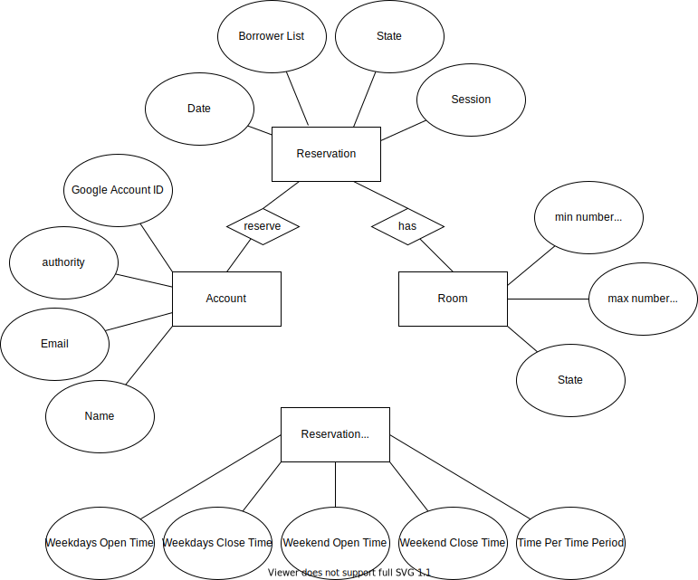

@import "Cover.md" 

## Table of Contents

[TOC]

## 1. Introduction

### 1.1 Purpose

<!-- 此文件的目的是用來描述我們的meeting room reservation system的整體架構，以及裡面細部的內容，系統內各部的objects的詳細功能、function的詳細作用及部分原碼，因此，此文件主要是用來給有工程背景的使用者或是管理者觀看的，當然，若你沒有工程背景，也歡迎閱讀此份文件並可以從中了解到部分系統的原理及架構。 -->

The purpose of this document is to describe the overall structure of our meeting room reservation system, as well as the detailed content inside of the system, the detailed functions of the objects in the system, and the detailed functions of different functions, and part of the original code. Therefore, this document is mainly used for users or managers with engineering background. Of course, if you don’t have engineering background, you are welcome to read this document and learn about the principles and architecture of the system.

### 1.2 Scope

<!-- 本meeting room reservation system的目的是為了讓需要使用會議室的人可以採用線上預約的方式進行，從而省下許多不必要的流程，如大老遠的通車就為了當面預約會議室，還有可能遇到客滿而撲空，用了本系統後就可以避免這種狀況，既節省人力又節省時間。 -->

The purpose of this meeting room reservation system is to allow people who need to use the meeting room to make online reservations, thus saving many unnecessary procedures. For example, spending lots of time commuting just to reserve meeting rooms in person, and there may be times when all rooms are full , this situation can be avoided after using this system, which saves both manpower and time.
## test.2
### 1.3 Overview
<!-- 
本文件的
第一章Introduction主要是拿來介紹本文件的章節，以及一些參考文件及名詞解釋
第二章System Overview是本系統的簡介
第三章System Architecture是介紹系統內部的主要架構，內部包含一些model的視覺化圖形來幫助理解，如ER model。
第四章Data Design是用來介紹本系統的資料結構設計。
第五章Component Design是用來介紹一些內部的function(含程式碼)、object的作用。
第六章Human Interface Design是用來介紹一些系統的UI、使用者介面的圖形。
第七章Requirements Matrix是一些系統的需求，將會以表格的形式呈現。 -->

The following is the overview of this document:

#### Chapter 1 Introduction

This chapter is mainly used to introduce the chapters of this document, and some reference documents and explanations of terms.

#### Chapter 2 System Overview 

This chapter is an introduction to the system.

#### Chapter 3 System Architecture 

This chapter is used to introduce the main internal architecture of the system, which contains some visual graphics of the model to help users understand, such as the ER model.

#### Chapter 4 Data Design 

This chapter is used to introduce the data structure design of this system.

#### Chapter 5 Component Design

This chapter is used to introduce some internal functions (including code) and the role of objects.

#### Chapter 6 Human Interface Design

This chapter is used to introduce some system UI and user interface graphics.

#### Chapter 7 Requirements Matrix

This chapter shows some system requirements, which will be presented in the form of tables.

### 1.4 Reference Material
<!-- 
這裡有兩份額外的文件，如果你對於本系統有興趣的話，也可以去看看。 -->

There are two extra files here, if you are interested in this system, you can also check it out.

1. SRS document.[<text>[1]</text>](#15-definitions-and-acronyms)
2. Architecture document.

### 1.5 Definitions and Acronyms

1. SRS document: SRS doucment is a software requirements specification (SRS) helps you lay the groundwork for product development.[1]

## 2. System Overview

##### Functional Analysis
<!-- 
Input:蒐集使用者對本系統欲執行動作的指令，如按按鈕、輸入資料等.
Output:根據使用者的行為進行相對應的資料呈現、預約等process. -->

Input: Collect the commands that users want to perform actions on the system, such as pressing buttons, inputting data, etc.

Output: According to the user's behavior, the corresponding data presentation, appointment and other processes are carried out.

##### Process

<!-- * 使用者查詢借用資料
* 使用者(管理層)查詢所有使用者借閱資料
* 調出借用資料
* 使用者取消預約
* 判斷能否取消(是否在時限內)
* 使用者借用會議室
* 判斷會議室能不能借(人數限制是否符合)
* 使用者(管理層)變更其他使用者的權限
* 判斷是否有權限變更該使用者
* 使用者(管理層)變更房間的設定 -->

* User query reservation information
* User (management level) queries all user reserving data
* Recall reserved data
* User cancels reservation
* Determine whether cancel reservation or not (whether it is within the time limit)
* User reserves reference room
* Determine whether the reference room can be borrowed or not (whether the number of people meets the limitation)
* The user (management level) changes the authority of other users
* Determine whether one has the  authority to change the user's authority
* The user (management level) changes the room settings

##### Modules

<!-- 根據本系統的功能，我們可以將模塊分成以下五種: -->
According to the functions of this system, we can divide the modules into the following five types:

1. login module
2. reservation module
3. record module
4. setting module
5. exit module

**login module**
<!-- 讓使用者登入的模塊。 -->
The module that allows users to log in.

**reservation module**
<!-- 可供使用者預約會議室的模塊、裡面包含了會議室編號、日期、時間、參與人等資料。 -->
A module for users to reserve a reference room, which contains the reference room's ID number, date, time, participants and other information.

**record module**
<!-- 可供使用者查詢借用紀錄的模塊、裡面包含了讓使用者取消的功能。 -->
A module for users to inquire about reserving records, which includes the function that allow users to cancel.

**setting module**
<!-- 管理員專用，可供管理員設定房間資料、使用者權限編輯的模塊。 -->
Only for managers, it is a module for managers to set room data and user's authority.

**exit module**
<!-- 讓使用著登出的模塊。 -->
The module that allows users to log out.

## 3. System Architecture

### 3.1 Architectural Design

### 3.2 Decomposition Description

**Data Flow Diagram:**

**level 0:**

**level 1:**

**level 2:**

### 3.3 Design Rationale

In section 3.1, we can see that there are four main entities. According to these four entities, users can know the architecture of the entire system more easily. Through the diagram in section 3.1, users can also know the attributes of each entity very easily, and could infer that what kind of data the system will need when the system is operating, and how the entire system works, too. We think it would be more convinient for users to get familiar with our system.

## 4. Data Design

This section describes the category of data required by the system. The data listed below showed the entity relationship of the system.

### 4.1 Data Description

This section explain how the information domain of the system is transformed into data structures. It also show the major data such as database and data storage items used in system. 

* A List of Room including:
    * Room number (Room ID)
    * The maximum number of total participants
    * The minimum number of total participants
    * The state of the room (enable or disable)
* The information about the reservation center:
    * The open hours during weekdays
    * The closed hours during weekdays 
    * The open hours during weekend
    * The closed hours during weekend
* The information about the room that user reserved:
    * Room number (Room ID)
    * The password of the Room
    * Reservation date and time
    * The rules of the room
* The information of Reservation made:
    * User's Name
    * Participants' email
    * Room number (Room ID)
    * Date and Time of the reservation
    * The Number of participants
* User Information, most importantly containing:
    * Google client ID
    * User's Room reservation records
    * User Privilege 
* Manager Information, most importantly containing:
    * Manager Google client ID
    * Manager Privilege

### 4.2 Data Dictionary

This section list the major data of the system by a table. As the table listed below describes the field name, data type, data format, field size, description and is it accepts null value.

**Account**
| Field Name | Data Type | Data Format | Field Size | Description | Accepts null value? | 
|------------|-----------|-------------|------------|-------------|---------------------|
| id | Int | OOO | 50 | The id of the user| N |
| Google_client_ID | String | OOO@email.com | 50 | The google client ID of the user | N |
| privilege | Int | | | Defined the user's privilege | Y |

**Room**
| Field Name | Data Type | Data Format | Field Size | Description | Accepts null value? | 
|------------|-----------|-------------|------------|-------------|---------------------|
| id | Int | OOO | 10 | The id of the room | N |
| maxNumberOfUsers | Int | | 10 | The maximum number of total participants | N |
| minNumberOfUsers | Int | | 10 | The minimum number of total participants | N |
| enable | Bool | |  | The room is enable or disable | N |

**Reservation**
| Field Name | Data Type | Data Format | Field Size | Description | Accepts null value? | 
|------------|-----------|-------------|------------|-------------|---------------------|
| user_Google_client_ID | Int | OOO@email.com | 50 | The google client ID of the user | N |
| participantsEmail | String | OOO@email.com | 50 | The participants' email | Y |
| room_id | Int | OOO | 10 | The id of the room | N | 
| num_participants | Int | | 10 | The number of the total participants | N |
| disable | Bool | |  | The room is enable or disable | N |

**Reservation_Center**
| Field Name | Data Type | Data Format | Field Size | Description | Accepts null value? | 
|------------|-----------|-------------|------------|-------------|---------------------|
| weekdaysOpenTime | Int | HHMM - HHMM | 10 | The open hours of the reservation center during weekdays | N |
| weekdaysCloseTime | Int | HHMM - HHMM | 10 | The close hours of the reservation center during weekdays | N |
| weekdendOpenTime | Int | HHMM - HHMM | 10 | The open hours of the reservation center during weekend | N |
| weekdendCloseTime | Int | HHMM - HHMM | 10 | The close hours of the reservation center during weekend | N |

## 5. Component Design
[張家菁]
In this section, we take a closer look at what each component does in a more systematic way. If you gave a functional description in section 3.2, provide a summary of your algorithm for each function listed in 3.2 in procedural description language (PDL) or pseudocode. If you gave an OO description, summarize each object member function for all the objects listed in 3.2 in PDL or pseudocode. Describe any local data when necessary.

## 6. Human Interface Design
[張家菁]

### 6.1 Overview of User Interface

Describe the functionality of the system from the user’s perspective. Explain how the user
will be able to use your system to complete all the expected features and the feedback
information that will be displayed for the user.

### 6.2 Screen Images

Display screenshots showing the interface from the user’s perspective. These can be hand­
drawn or you can use an automated drawing tool. Just make them as accurate as possible.
(Graph paper works well.)
6.3 Screen Objects and Actions
A discussion of screen objects and actions associated with those objects.

## 7. Requirements Matrix

<!-- ## 8. APPENDICES

This section is optional.
Appendices may be included, either directly or by reference, to provide supporting details that could
aid in the understanding of the Software Design Document. -->