# Software Design Document

## 1. Introduction

### 1.1 Purpose

此文件的目的是用來描述我們的meeting room reservation system的整體架構，以及裡面細部的內容，系統內各部的objects的詳細功能、function的詳細作用及部分原碼，因此，此文件主要是用來給有工程背景的使用者或是管理者觀看的，當然，若你沒有工程背景，也歡迎閱讀此份文件並可以從中了解到部分系統的原理及架構。

### 1.2 Scope

本meeting room reservation system的目的是為了讓需要使用會議室的人可以採用線上預約的方式進行，從而省下許多不必要的流程，如大老遠的通車就為了當面預約會議室，還有可能遇到客滿而撲空，用了本系統後就可以避免這種狀況，既節省人力又節省時間。

### 1.3 Overview

本文件的
第一章Introduction主要是拿來介紹本文件的章節，以及一些參考文件及名詞解釋
第二章System Overview是本系統的簡介
第三章System Architecture是介紹系統內部的主要架構，內部包含一些model的視覺化圖形來幫助理解，如ER model。
第四章Data Design是用來介紹本系統的資料結構設計。
第五章Component Design是用來介紹一些內部的function(含程式碼)、object的作用。
第六章Human Interface Design是用來介紹一些系統的UI、使用者介面的圖形。
第七章Requirements Matrix是一些系統的需求，將會以表格的形式呈現。

### 1.4 Reference Material

這裡有兩份額外的文件，如果你對於本系統有興趣的話，也可以去看看。
1. SRS document.[1]
2. Architecture document.

### 1.5 Definitions and Acronyms

1. SRS document:SRS doucment is a software requirements specification (SRS) helps you lay the groundwork for product development.[1]

## 2. System Overview

##### Functional Analysis
Input:蒐集使用者對本系統欲執行動作的指令，如按按鈕、輸入資料等.
Output:根據使用者的行為進行相對應的資料呈現、預約等process.
##### Process
* 使用者查詢借用資料
* 使用者(管理層)查詢所有使用者借閱資料
* 調出借用資料
* 使用者取消預約
* 判斷能否取消(是否在時限內)
* 使用者借用會議室
* 判斷會議室能不能借(人數限制是否符合)
* 使用者(管理層)變更其他使用者的權限
* 判斷是否有權限變更該使用者
* 使用者(管理層)變更房間的設定
##### Modules
根據本系統的功能，我們可以將模塊分成以下五種:
1. login module
2. reservation module
3. record module
4. setting module
5. exit module

**login module**
讓使用者登入的模塊。

**reservation module**
可供使用者預約會議室的模塊、裡面包含了會議室編號、日期、時間、參與人等資料。

**record module**
可供使用者查詢借用紀錄的模塊、裡面包含了讓使用者取消的功能。

**setting module**
管理員專用，可供管理員設定房間資料、使用者權限編輯的模塊。

**exit module**
讓使用著登出的模塊。

## 3. System Architecture

### 3.1 Architectural Design
[阿旻]

Develop a modular program structure and explain the relationships between the modules to achieve the complete functionality of the system. This is a high level overview of how responsibilities of the system were partitioned and then assigned to subsystems. Identify each high level subsystem and the roles or responsibilities assigned to it. Describe how these subsystems collaborate with each other in order to achieve the desired functionality. Don’t go into too much detail about the individual subsystems. The main purpose is to gain a general understanding of how and why the system was decomposed, and how the individual parts work together. Provide a diagram showing the major subsystems and data repositories and their interconnections. Describe the diagram if required.

ER MODEL 上網查參考

### 3.2 Decomposition Description

**Data Flow Diagram:**
**level 0:**

**level 1:**

**level 2:**

### 3.3 Design Rationale
[阿旻]

Discuss the rationale for selecting the architecture described in 3.1 including critical issues
and trade/offs that were considered. You may discuss other architectures that were
considered, provided that you explain why you didn’t choose them.

## 4. Data Design
[欣童]

### 4.1 Data Description

Explain how the information domain of your system is transformed into data structures.
Describe how the major data or system entities are stored, processed and organized. List any
databases or data storage items.

### 4.2 Data Dictionary

Alphabetically list the system entities or major data along with their types and descriptions. If
you provided a functional description in Section 3.2, list all the functions and function
parameters. If you provided an OO description, list the objects and its attributes, methods and
method parameters.

## 5. Component Design
[張家菁]
In this section, we take a closer look at what each component does in a more systematic way. If you gave a functional description in section 3.2, provide a summary of your algorithm for each function listed in 3.2 in procedural description language (PDL) or pseudocode. If you gave an OO description, summarize each object member function for all the objects listed in 3.2 in PDL or pseudocode. Describe any local data when necessary.

## 6. Human Interface Design
[張家菁]

### 6.1 Overview of User Interface

Describe the functionality of the system from the user’s perspective. Explain how the user
will be able to use your system to complete all the expected features and the feedback
information that will be displayed for the user.

### 6.2 Screen Images

Display screenshots showing the interface from the user’s perspective. These can be hand­
drawn or you can use an automated drawing tool. Just make them as accurate as possible.
(Graph paper works well.)
6.3 Screen Objects and Actions
A discussion of screen objects and actions associated with those objects.

## 7. Requirements Matrix
[欣童]

Provide a cross­reference that traces components and data structures to the requirements in your SRS document.
Use a tabular format to show which system components satisfy each of the functional
requirements from the SRS. Refer to the functional requirements by the numbers/codes that you gave them in the SRS.

## 8. APPENDICES

This section is optional.
Appendices may be included, either directly or by reference, to provide supporting details that could
aid in the understanding of the Software Design Document.